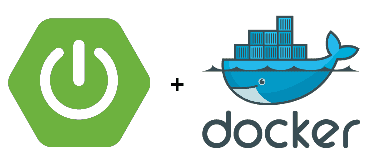

# Movie Shop

## Spring Boot & Docker Uygulaması



### Kullanılan Araçlar

```
JDK: v11.0.11
Maven: v3.8.1
Docker: v20.10.7
```

### Endpointler

```
GET: /api/v1/directors
POST: /api/v1/directors | params: {name: String, surname: String}
GET: /api/v1/movies
POST: /api/v1/movies  | params: {name: String, rank: int, directorId: UUID}
```

### Docker Kullanım Talimatları

1. Projeyi tamamladıktan sonra konteynerlaştırmak istediğimiz versiyoununun .jar ya da .war paketini oluşturmalıyız.
2. mvn clean -> Build Project -> mvn install işlemleri ile /target dizini içerisinde .jar ya da .war paketi oluşacaktır.
3. Projenin en üst dizini içerisinde Dockerfile dosyasını oluşturuyoruz ve gerekli konfigürasyonlarını yapıyoruz.
    ```
    # Dockerfile
    
    /* Projemizin teknolojisine göre seçiyoruz. (Docker Hub içerisinden bulabiliriz.) */ 
    FROM openjdk:11
    
    /* Konteynerımızı hangi dizinde oluşturmak istediğimizi belirliyoruz. */
    WORKDIR /app
    
    /* İmajını oluşturmak istediğimiz dosyayı belirtiyoruz. /target içerisinden /app içersine imaj kopyalıyoruz. */
    COPY target/movie-shop-0.0.1-SNAPSHOT.jar movie-shop-0.0.1-SNAPSHOT.jar
    
    /* Kullanılacak komutun argümanlarını belirtiyoruz. */
    ENTRYPOINT ["java", "-jar", "movie-shop-0.0.1-SNAPSHOT.jar"]
    ```
4. Projemizin içerisindeyken Dockerfile konfigürasyonu tamamlandıktan sonra imajımızı oluşturmak için şu komutları
   giriyoruz.
    - movieshop ismiyle tag'leyip, versiyonunu belirtiyoruz. Nokta da Dockerfile dosyasını bulmaya yarıyor.
        > docker build -t movieshop:0.0.1 .
    - Bu komut movishop ismiyle önceden oluşturduğumuz movieshop:0.0.1 imajını çalıştır demek.
        > docker run -d --name movieshop movieshop:0.0.1
5. Bazı Docker komutları.
    - Bu komutla şu an hangi imajların çalıştığını görebiliriz.
        > docker ps
    - Bu komut ile movieshop konteynerını dinleriz.
        > docker logs -f movieshop
    - Bu komut ile istediğimiz konteynerı sonlandırırız.
        > docker kill movieshop
    - Bu komut ile istediğimiz konteynerı sileriz. (Eğer çalışır durumdaysa --force tag'ini eklemeliyiz.)
        > docker rm movieshop (docker rm --force movieshop)
    - Bu komut ile port map'leme işlemi yapıyoruz. Yani konteynerımızdaki uygulamamızı hangi port ile erişeceğimizi
    belirliyoruz. Mesela -p 9090:8080 tag'ini yazarsak 9090 port'u üzerinden uygulamamıza erişebiliriz.
    Burada 9090 hangi port'tan erişeceğimizi, 8080 ise konteyner içerisinde uygulamanın hangi port üzerinden olduğuydu.
        > docker run -d -p 9090:8080 --name movieshop movieshop:0.0.1
    - Bu komut ile oluşturulmuş Image listesini görebiliriz.
        > docker image ls
    - Bu komut ile belirtilen ID'li image'ı silebiliriz.
        > docker rmi <ImageID>
    - Bu komut ile image'ımızın terminalini kullanabiliyoruz.
        > docker exec -it movieshop bash
6. Ayrıca aynanda birden fazla konteynerla çalışmak istiyorsak docker-compose.yml dosyası oluşturmamız gerekmektedir.
Birden fazla servis tanımlayıp aynanda çalıştırabiliriz. Mesela bu projede h2database ayrı bir konteyner olarak
kullanılacaktır. Onun için de application-docker.properties içerisinde h2database konfigürasyonlarını yaptık. Ardından
Dockerfile dosyamızı ve docker-compose.yml dosyalarımızı buna göre ayarladık.
    - docker-compose.yml dosyasını çalıştırmak için de şu komut gereklidir.
        > docker-compose up
